# 🍬 Sweet Shop Management System 

## 📌 Project Overview
The **Sweet Shop Management System** is a full-stack web application designed to manage a sweet shop's operations efficiently. It allows users to browse available sweets, search and filter them, and purchase items based on availability. The system also supports **authentication and authorization**, distinguishing between **regular users** and **admin users**.

This project was built as part of a technical assessment with a strong focus on:
- Clean architecture
- Test-Driven Development (TDD)
- Separation of concerns (routes, controllers, services)
- Scalable frontend architecture

---

## ✨ Key Features

### 👤 Authentication
- User registration and login
- JWT-based authentication
- Persistent login using `/auth/me`

### 🍭 Sweet Management
#### according to assessment
- View all available sweets
- Search and filter sweets
- Add and Edit Sweets
- Purchase sweets (disabled if out of stock)

### 🛠️ Admin Capabilities
- Delete sweets
- Restock Sweets

### 🎨 UI/UX
- Responsive design
- Clean and modern UI
- Loading states and error handling

---

## 🧱 Tech Stack

### Backend
- Node.js
- Express.js
- MongoDB + Mongoose
- JWT Authentication
- Jest + Supertest (Testing)

### Frontend
- React
- Context API (Authentication state)
- Axios
- Tailwind CSS

---

## ⚙️ Setup Instructions

### 📂 Clone the Repository
```bash
git clone https://github.com/Vidhi-0603/SweetShopManagement/
cd SweetShopManagement
```

---

## 🔧 Backend Setup

```bash
cd backend
npm install
```

### Environment Variables
Create a `.env` file in the `backend` directory:
```env
PORT=5000
MONGO_URI=your_mongodb_connection_string
JWT_SECRET=your_secret_key
CLIENT_URL=your_frontend_url
```

### Environment Variables
Create a `.env` file in the `frontend` directory:
```env
VITE_APP_URL=your_backend_url
```

### Run Backend Server
```bash
npm run dev
# or
node server.js
```

Backend will run on:
```
http://localhost:5000
```

---

## 🎨 Frontend Setup

```bash
cd frontend
npm install
npm run dev
```

Frontend will run on:
```
http://localhost:5173
```

---

## 🔐 Authentication Flow

- On login/register, JWT is issued
- Token is stored securely (cookie / local storage depending on config)
- On refresh, `/api/auth/me` is called to persist user session

---

## 🧪 Testing

This project follows **Test-Driven Development (TDD)** principles.

### Test Coverage Includes:
- Route tests
- Controller mocking
- Service tests
- Middleware mocking

### Run Tests

```bash
npm test
```

---

## 📊 Test Report

```
 PASS  Auth Routes
  ✓ POST /api/auth/register returns 201
  ✓ POST /api/auth/login returns 200
  ✓ GET /api/auth/me returns authenticated user(authenticates user on page refresh)

 PASS  Auth Services
  ✓ registerUser returns token and user
  ✓ loginUser returns token and user
  ✓ authUser returns user by id(authenticates user on page refresh)


```
### Refer to: 


---

## 📸 Screenshots

### 🔐 Login Page
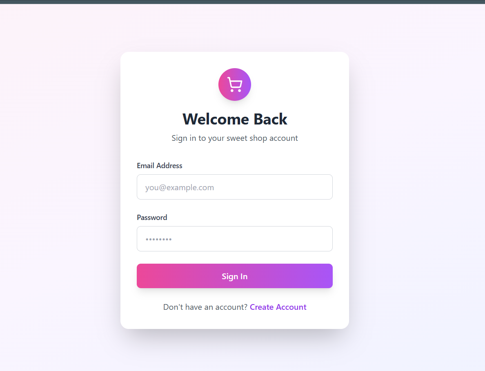

### 📝 Register Page
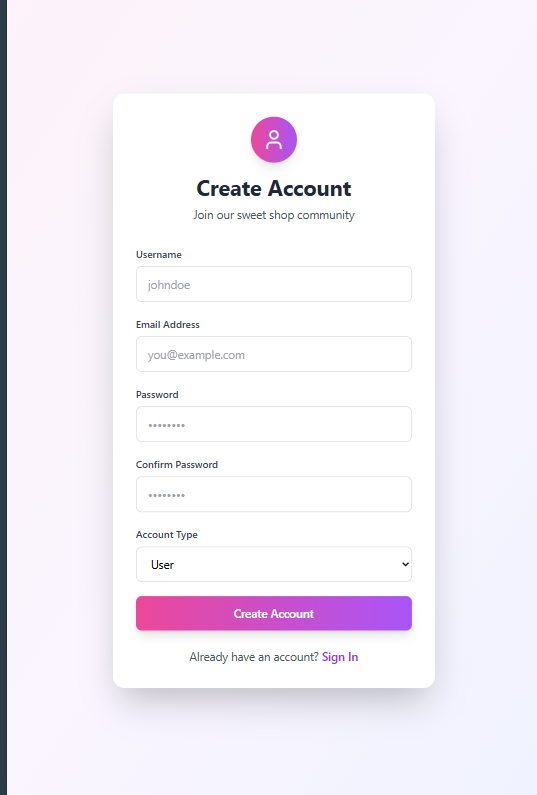

### 📊 Dashboard (User)
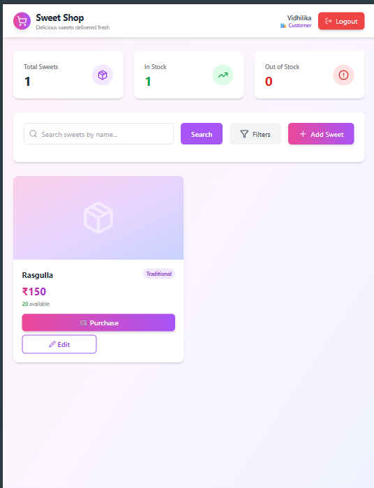

### 📊 Dashboard (Admin)
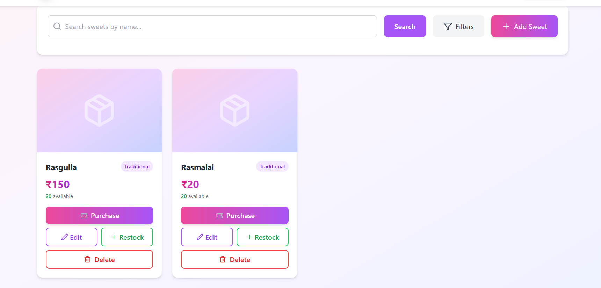

### ➕ Add Sweet (Admin)
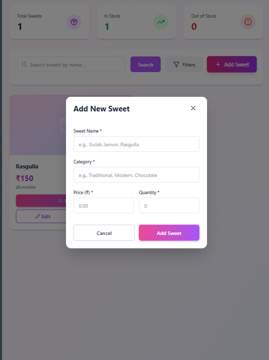

### ✏️ Edit Sweet (Admin)
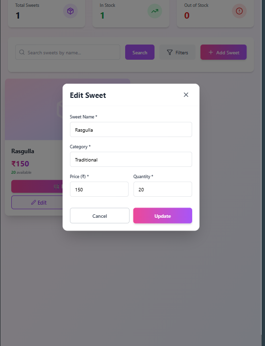

### 🗑️ Delete Sweet (Admin)
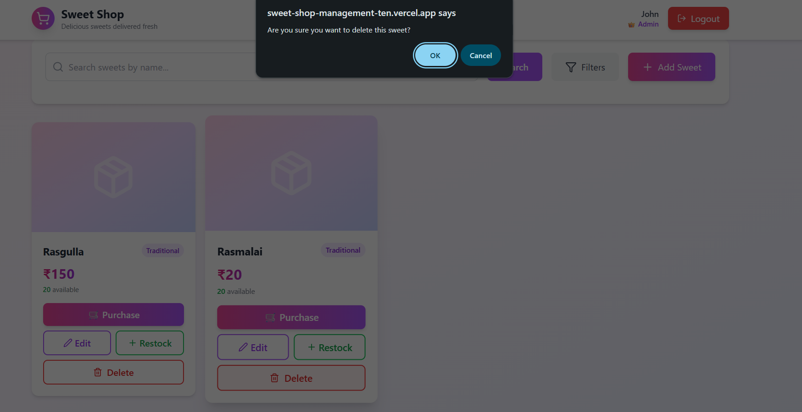

### 🔄 Restock Sweet (Admin)


### 🔍 Filter / Search
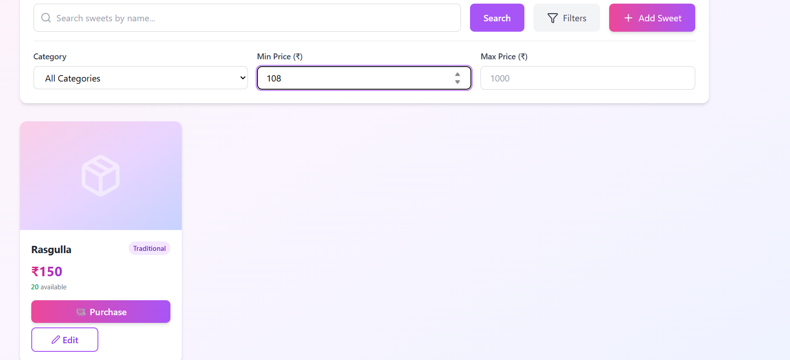

### 🧾 Display Sweets
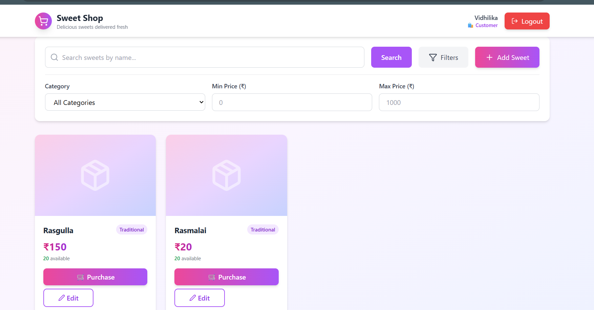

### 🛒 Purchase Sweet
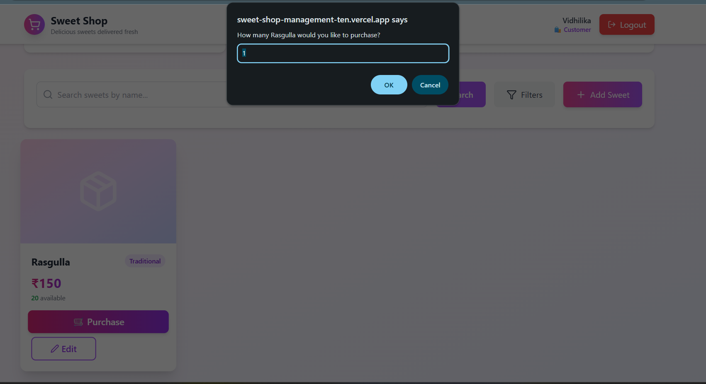

### ✅ Admin Register
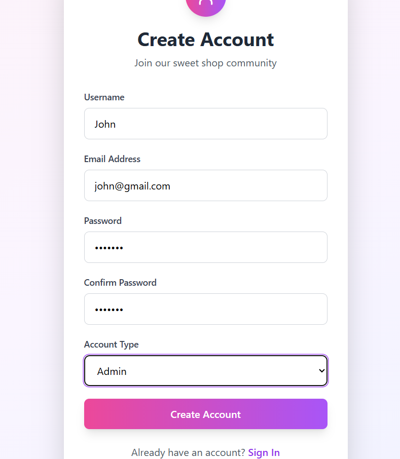
---

## 🤖 My AI Usage

### How AI Was Used

AI tools (ChatGPT) were used responsibly during the development of this project to:
- Clarify backend architecture and best practices
- Understand Test-Driven Development workflows
- Debug Jest mocking and middleware issues
- Improve code structure and readability
- Generate boilerplate code for tests and documentation

### How AI Was NOT Used
- No AI-generated code was blindly copied without understanding
- All logic was reviewed, modified, and tested manually
- Final implementation decisions were made independently

The AI served as a **learning and productivity aid**, not a replacement for original work.

---

## 📌 Submission Notes

- `.env` files are excluded from version control
- `node_modules` folders are excluded
- Both frontend and backend run independently

---

## ✅ Conclusion

This project demonstrates:
- Strong fundamentals in full-stack development
- Clean separation of concerns
- Proper authentication handling
- Practical use of TDD

It is production-structured, scalable, and interview-ready.

---

⭐ *Thank you for reviewing this project!*

